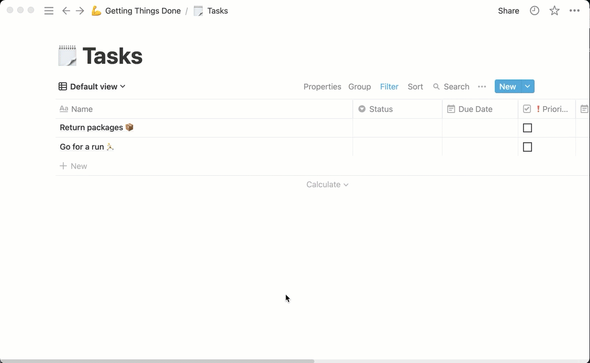
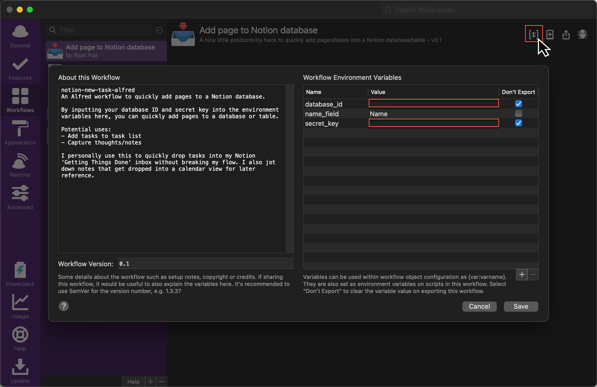

# notion-new-task-alfred-workflow

An Alfred workflow to quickly add a page to a database.

Simply type the keyword into Alfred ('task' by default) and then add the name of your page/task to add to the database.

This can be used to quickly add a task to your task list for sorting later.

## Workflow Variables

- `database_id`: The ID of the database that you're adding pages to
- `secret_key`: Also known as the 'Internal Integration Token', you need this when you create your integration with the database, more below.
- `name_field`: Defaults to 'Name'. This is the primary field of the database page, typically the title.

## Obtaining your workflow variables

### `database_id`

Retrieving the `database_id` is simple enough. Check the 'Where can I find my datbase's ID?' in the [Notion developer docs](https://developers.notion.com/docs/working-with-databases#adding-pages-to-a-database).

### `secret_key`

This workflow uses the Notion API (currently in Beta) and to add pages to a database. Before working with the API, you'll need to create an integration and this is where you can grab the 'Internal Integration Token' or `secret_key`. You'll also need to share the database with the integration. You can follow the short steps in the [Notion API docs](https://developers.notion.com/docs/getting-started#step-1-create-an-integration).

### `name_field`

This is 'Name' by default and is the name of the title field used for each page in your database. Unless if you have changed the name, it will most likely be 'Name'.

## Adding the variables to the Alfred workflow

In the Alfred worfklow in the upper right corner click the `[x]` icon and add the values from above to the corresponding value field.

## Downloading/Installing

## Troubleshooting

- Check the name of the main field of the page in the databse. Maybe you've changed it to 'Task' or similar.
- Make sure you've [shared the database with the integration](https://developers.notion.com/docs/getting-started#step-2-share-a-database-with-your-integration).
